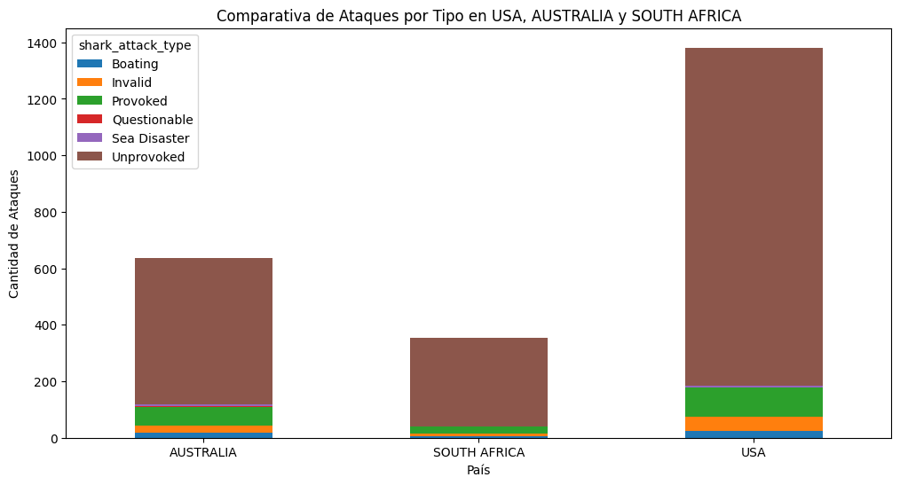
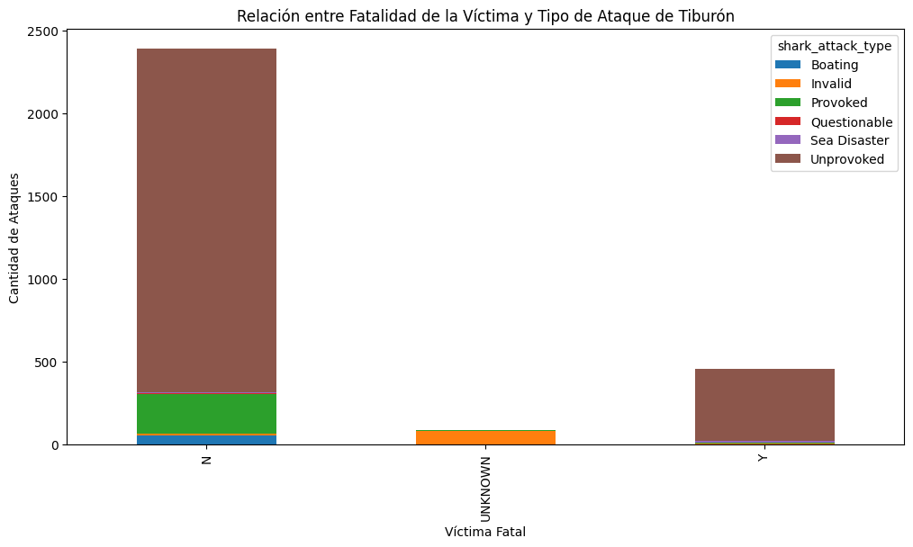

#Proyecto Ataque de Tiburones

##Introducción

En este proyecto voy a limpiar y analizar los datos sobre ataques de tiburones a personas. Es el primer proyecto del curso, y la clave será quedarnos como mínimo con 2500 filas y 23 columnas, comparándolo con los valores inciales de 25723 filas y 24 columnas. 

##Objetivos, obligaciones y restricciones

🦈 OBJETIVOS:  
- Realizar limpieza de los datos, cargar los datos, exploración, describe, quitar nulos, establecer criterio ordenado en las columnas, etc.
- Bonus: tener un objetivo y realizar un análisis del mismo

🦈 OBLIGACIÓN MIN:
- df.shape == (2500,23) COMO MINIMO 

🦈 RESTRICCIONES:
- NO SE BORRAN COLUMNAS (se pueden añadir columnas)
- AL MENOS 2500 FILAS 
- Deadline: MARTES

##Proceso de limpieza:

1. Importar librerías y descargar el documento csv
2. Exploración inicial
3. Limpieza:
- Cambio de nombres y orden de las columnas
- Eliminación de los duplicados
- Eliminación de los valores nulos
- Corrección de los valores de las columnas a estudiar

##Análisis:

##Conclusiones:

- El Dataframe original es un caos 😫
- Los países más comunes son USA, AUSTRALIA y SOUTH AFRICA
- La mayoría de los ataques NO fueron PROVOCADOS 
- La mayoría de las heridas fueron NO LETALES